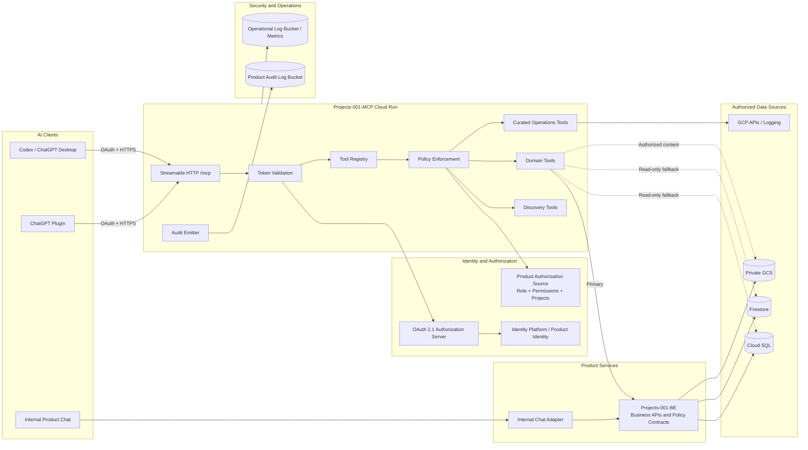

# Product MCP Implementation Plan

> แผนการสร้าง Product MCP สำหรับ Projects-001 เพื่อให้ AI เข้าถึงข้อมูลธุรกิจและข้อมูลปฏิบัติการที่ผู้ใช้มีสิทธิ์ได้อย่างปลอดภัย มีหลักฐานอ้างอิง และเป็น read-only ต่อ Business Data

| รายการ | ค่า |
|---|---|
| สถานะเอกสาร | Approved planning baseline — implementation not started |
| วันที่จัดทำ | 2026-07-27 |
| GCP project | `project001-489710` |
| Environments | Demo lab และ Beta |
| Repository target | `Projects-001-MCP/` |
| Demo Cloud Run target | `projects-001-mcp` |
| Beta Cloud Run target | `projects-001-mcp-beta` |
| MCP transport | Streamable HTTP ที่ stable `/mcp` endpoint |
| Product data mode | Read-only |
| Eligible roles | `owner`, `admin` เท่านั้น |

## 1. วัตถุประสงค์ของเอกสาร

เอกสารนี้เป็น implementation plan ที่รวมข้อสรุป D-01 ถึง D-33 ให้กลายเป็นลำดับงานที่ทีมสามารถนำไป implement, test และ rollout ได้ โดยยังไม่ถือว่าเป็นการอนุมัติให้เขียน Product code หรือ deploy ระบบ

เป้าหมายของ Product MCP คือทำให้ AI สามารถเข้าถึงข้อมูลทั้งหมดที่ผู้ใช้มีสิทธิ์เมื่อจำเป็น เพื่อให้คำปรึกษา วิเคราะห์ และตอบคำถามได้มีประสิทธิภาพสูงขึ้น โดยไม่โหลดข้อมูลทั้งหมดเข้า context พร้อมกัน และไม่เปิดเผย secret ทุกกรณี

คำว่า “ข้อมูลทั้งหมด” ในแผนนี้หมายถึง:

- ครบทั้ง 10 Product Domains ที่ยืนยันแล้ว
- เข้าถึงแบบ on-demand และ progressive retrieval
- ถูกกรองด้วย environment, role, permission และ assigned projects ก่อนส่งเข้า AI
- รองรับ current version, historical version, point-in-time และ version comparison
- ส่งคืน source, freshness และ version metadata เพื่อให้ตรวจสอบย้อนกลับได้
- ไม่รวม password, token, private key, credential, Secret Manager payload หรือ signed URL secret

## 2. Decision Register

Decision ต่อไปนี้เป็น baseline ที่ต้องรักษา หาก implementation จำเป็นต้องเปลี่ยนข้อใด ให้สร้าง Architecture Decision Record (ADR) และขออนุมัติก่อน

| ID | ข้อสรุปที่ยืนยันแล้ว |
|---|---|
| D-01 | AI ต้องเข้าถึงข้อมูลที่ผู้ใช้มีสิทธิ์ทั้งหมดได้แบบ on-demand เพื่อช่วยผู้ใช้ได้เต็มประสิทธิภาพ โดย secrets ถูกห้ามเสมอ |
| D-02 | Scope มีเฉพาะ Demo และ Beta ใช้ codebase เดียวกันและแยกด้วย config/resources; data sources คือ Cloud SQL, Firestore, Backend APIs และ GCS; BigQuery และบริการภายนอกไม่ใช่ data source โดยตรง |
| D-03 | ใช้ Hybrid Access: Backend APIs เป็นทางหลักของ business data, GCP APIs เป็นทางหลักของ operations, direct database/storage เป็น read-only fallback |
| D-04 | MCP เป็น Product capability สำหรับผู้ใช้ฝั่งเจ้าของระบบ; eligibility ของ role ถูกปรับให้เหลือ `owner` และ `admin` ตาม D-24 |
| D-05 | รองรับ External ChatGPT/Codex และ Internal Product Chat โดยใช้ Tool/Policy semantics ชุดเดียวกัน |
| D-06 | หนึ่งบริษัทต่อ environment/deployment ไม่ทำ shared multi-tenancy ภายใน MCP instance |
| D-07 | Deploy MCP แยก Cloud Run service และ URL ระหว่าง Demo/Beta แต่ใช้ codebase เดียวกัน |
| D-08 | MCP เป็น read-only ต่อ Business Data ไม่มี create/update/delete/approve/publish/deploy/revoke-link actions |
| D-09 | Owner อ่าน private document content ได้ตามสิทธิ์ แต่ password/token/private key/credential ถูกห้ามทุกกรณี |
| D-10 | Authorization ใช้ Role + additional permissions + assigned projects และตรวจฝั่ง server ทุก tool call |
| D-11 | รองรับ 10 Domains: System Catalog, GCP Operations, Projects/BOQ, Finance/Payments, Users/Access, Inspection, Daily Reports, GCS Files, Dashboard/Insights และ History/Audit |
| D-12 | Product MCP มี Discovery + Domain + Curated Operations Tools; Generic Diagnostic MCP แยกเป็น internal service |
| D-13 | External clients ใช้ per-user OAuth 2.1; Internal Chat ใช้ login ปัจจุบัน; ทั้งสองใช้ Policy rules ชุดเดียวกัน |
| D-14 | MCP เป็น version-aware: current, history, as-of และ compare; Document Version แยกจาก Share-link State |
| D-15 | ใช้ Progressive Retrieval ไม่โหลดหรือคัดลอกข้อมูลทั้งหมดเข้า AI พร้อมกัน |
| D-16 | แยก Product Audit Trail และ Operational Telemetry; ไม่เก็บ token, prompt/response หรือ document body เต็มใน log |
| D-17 | เริ่มด้วย Federated Search และเตรียม interface สำหรับ Derived Semantic Index ในอนาคต |
| D-18 | MCP endpoint เข้าถึงผ่าน HTTPS + OAuth; แยก service identity; least privilege; direct DB ใช้ read-only account |
| D-19 | ใช้ Source-of-Truth Map; Backend business contract มาก่อน raw source; แจ้ง inconsistency แทนการรวมข้อมูลเอง |
| D-20 | ใช้ Official Python MCP SDK + Streamable HTTP `/mcp`; standard `search`/`fetch`; stable tool contracts; UI ยังไม่อยู่ในระยะแรก |
| D-21 | ใช้ Document Content Gateway; metadata-first; ไม่คืน `gs://`, credential หรือ signed URL ให้ AI |
| D-22 | Rollout แบบ vertical slices โดย deploy/test ใน Demo lab ก่อน แล้วจึง Beta หลังผ่าน Release Gates |
| D-23 | ทำ Auth Compatibility Spike ก่อนเลือก OAuth/IdP; ไม่ใช้ Product session token ปัจจุบันเป็น MCP OAuth token |
| D-24 | Eligible roles มีเฉพาะ `owner` และ `admin`; role อื่นไม่มี MCP access |
| D-25 | ทุก Tool ใช้ Common Response Contract, structured errors, exact money และ backward-compatible schema |
| D-26 | ต้องผ่าน protocol, auth, isolation, read-only, accuracy, security, audit, failure, client และ performance tests ก่อน Beta |
| D-27 | Owner ควบคุม External MCP; per-user consent/revocation; sensitive content ไม่ถูก prefetch; รองรับ `external_ai_blocked` |
| D-28 | Retention: Demo audit/security 90 วัน, Beta 365 วัน, operational logs 30 วัน, non-PII metrics 13 เดือน |
| D-29 | ใช้ Golden Use Cases ภาษาไทย/อังกฤษเป็น baseline ของ Tool design และ evaluation |
| D-30 | ใช้ Initial Tool Inventory ที่ยืนยันแล้ว; ไม่มี arbitrary SQL/path/secrets tools |
| D-31 | สร้าง `Projects-001-MCP/` เป็น service แยกใน repo; deploy ด้วย `deploy_mcp.sh`; plan อยู่ในไฟล์นี้ |
| D-32 | Read-only อนุญาต technical side effects เฉพาะ Audit, Security logs, Metrics และ Traces |
| D-33 | Client rollout: MCP Inspector → Codex/ChatGPT Desktop Owner → Internal Chat → Admin → Private Plugin → Beta → Publish |

## 3. Current-State Baseline

ข้อมูลส่วนนี้มาจาก source code, deployment configuration และ read-only GCP inventory ณ วันที่ 2026-07-27 ข้อมูล live อาจเปลี่ยนได้ จึงต้องมี preflight inventory ซ้ำก่อนเริ่ม implementation และก่อน deploy ทุก environment

### 3.1 Repository ปัจจุบัน

```text
Projects-001/
├── Projects-001-FE/              React + Vite
├── Projects-001-BE/              FastAPI + Python
├── Design/
├── docs/
├── deploy_backend.sh
├── deploy_frontend.sh
├── cloudrun.env                  Demo shared config
└── cloudrun-beta.env             Beta shared config
```

ยังไม่มี `Projects-001-MCP/` และ `deploy_mcp.sh` ณ เวลาจัดทำเอกสาร

### 3.2 Backend capabilities ที่นำมาใช้ต่อได้

- Backend routers ครอบคลุม Projects/BOQ, Bills, Input Requests, Settings, Dashboard, Insights, Inspection, Daily Reports และ Chat AI
- BOQ ใช้ SCD2-style fields `valid_from` และ `valid_to`; `valid_to = NULL` หมายถึง current record
- Daily Reports เก็บ immutable published versions ใน Firestore collection `daily_report_versions`
- Daily Report share link มี config/state แยกจาก report version
- Authentication ปัจจุบันใช้ Firebase/Identity Platform login แล้ว Backend ออก Product HMAC session token
- Current Chat AI ทำ grounded analytics จาก database ก่อนส่ง context ให้ LLM แต่จำกัด Owner และมี chat history ที่เขียนลง database
- Existing authorization มี roles และ assigned-project concepts อยู่แล้ว แต่ MCP permissions ใหม่ยังไม่มี

Relevant source references:

- `Projects-001-BE/app/api/deps/auth.py`
- `Projects-001-BE/app/api/v1/auth.py`
- `Projects-001-BE/app/core/security.py`
- `Projects-001-BE/app/api/v1/projects.py`
- `Projects-001-BE/app/models/boq.py`
- `Projects-001-BE/app/api/v1/daily_reports.py`
- `Projects-001-BE/app/services/daily_report_service.py`
- `Projects-001-BE/app/api/v1/chat.py`
- `Projects-001-BE/app/services/chat_analytics_service.py`
- `Projects-001-BE/app/services/gcs_storage_service.py`

### 3.3 Environment และ Resource Mapping

| Resource | Demo lab | Beta |
|---|---|---|
| GCP project | `project001-489710` | `project001-489710` |
| Region | `asia-southeast1` | `asia-southeast1` |
| App env | `production` | `prod-beta` |
| Backend Cloud Run | `projects-001-be` | `projects-001-be-beta` |
| Frontend Cloud Run | `projects-001-fe` | `projects-001-fe-beta` |
| MCP Cloud Run target | `projects-001-mcp` | `projects-001-mcp-beta` |
| Cloud SQL | `project-001` | `project-001-beta` |
| Firestore database | `(default)` | `prod-beta` |
| Identity Platform tenant | Current config does not set a dedicated tenant | `beta-company-001-bswmk` |
| KYC bucket | `kyc_id_cards` | `kyc_id_cards-beta` |
| Temporary bills bucket | `temp_bills` | `temp_bills-beta` |
| Permanent bills bucket | `perm_bills` | `perm_bills-beta` |
| Inspection bucket | `project001-489710-work-inspection` | `project001-489710-work-inspection-beta` |
| Daily reports bucket | `project001-489710-daily-reports-demo` | `project001-489710-daily-reports-beta` |

### 3.4 Explicit Exclusions

ทรัพยากรต่อไปนี้ถูกพบใน GCP แต่ห้ามถือเป็น Product MCP data source:

- BigQuery dataset `devtest` — มีอยู่จริง แต่ถูกตัดออกตาม D-02/D-11; ห้ามสร้าง BigQuery adapter ใน Product MCP
- Cloud Run `project-saas-001-be` และ `project-saas-001-fe`
- Cloud SQL `project-001-saas` และ `project-001-saas-restore-test`
- System/import buckets ที่ไม่ได้อยู่ใน environment mapping ด้านบน
- FlowAccount API, LINE API, Google Sheets API และบริการภายนอกอื่น ๆ แบบ direct access

Product MCP อ่าน metadata ที่ถูก sync เข้ามาใน Product แล้วได้ตาม Domain permissions แต่ห้ามเรียกบริการภายนอกเหล่านี้โดยตรง

ข้อควรระวัง: Demo Backend Cloud Run ปัจจุบันมี Cloud SQL attachment ที่รวม `project-001-saas` อยู่ด้วย แม้ Backend จะใช้งาน attachment นี้อยู่ Product MCP Demo ต้องไม่มี IAM, network target หรือ database credential ที่เข้าถึง instance ดังกล่าว

### 3.5 Existing Local Diagnostic MCP

ไฟล์ `.codex/skills/gcp-project001-ops/scripts/gcp_mcp_server.py` เป็น local diagnostic MCP สำหรับ Codex เท่านั้น มี generic tools เช่น raw read-only SQL, Firestore path queries, logs และ resource inventory

กติกา:

- ใช้เป็น reference ด้าน validation/redaction ได้
- ห้ามนำไป deploy เป็น Product MCP
- ห้าม import เป็น Product MCP runtime dependency
- Generic Diagnostic MCP ต้องอยู่คนละ service, config, identity และ access policy

## 4. Goals และ Non-goals

### 4.1 Product Goals

1. ให้ Owner/Admin ที่ได้รับสิทธิ์ถาม AI เกี่ยวกับข้อมูลครบทั้ง 10 Domains
2. ให้ AI ค้นหา → อ่านสรุป → drill down → ตรวจ version/source ได้เป็นขั้นตอน
3. ให้ External ChatGPT/Codex และ Internal Product Chat ใช้ business/tool semantics เดียวกัน
4. แยก Demo/Beta ทาง deployment, identity และ resource permissions
5. ทำให้ทุก sensitive access ตรวจสอบย้อนหลังได้
6. ทำให้ Tool contracts ใช้เป็น Product interface ที่ version และทดสอบได้
7. รองรับการเพิ่ม Semantic Search ภายหลังโดยไม่เปลี่ยน Source of Truth

### 4.2 Non-goals

- ไม่มี write/action tools
- ไม่มี customer, subcontractor, inspector, staff หรือ public user access
- ไม่มี BigQuery integration
- ไม่มี direct external-service integration
- ไม่มี arbitrary SQL, arbitrary Firestore path, arbitrary GCS path หรือ generic `gcloud` tools
- ไม่มี Secret Manager payload tools
- ไม่มี full data dump เข้า model context
- ไม่มี Vector Database ใน initial release
- ไม่มี MCP custom UI ใน initial release
- ไม่มีการ publish public Plugin ก่อน Demo/Beta gates ผ่าน
- ไม่มีการเปลี่ยน Product AI model เป็นส่วนหนึ่งของ MCP foundation โดยอัตโนมัติ

## 5. Target Architecture



### 5.1 Architectural Boundaries

1. **External transport boundary** — `/mcp` รับเฉพาะ HTTPS และ OAuth-authenticated requests ยกเว้น health/discovery metadata ที่ไม่มี business data
2. **User authorization boundary** — MCP re-resolves active Product user, role, permissions และ project scope ทุก request หรือผ่าน short-lived cache
3. **Service identity boundary** — MCP เรียก Backend ด้วย service-to-service identity และส่ง user subject/request context แบบที่ Backend ตรวจความถูกต้องได้
4. **Business-rule boundary** — Backend API/Business Service เป็นผู้ตัดสิน business semantics; MCP ไม่สร้างกฎธุรกิจซ้ำ
5. **Fallback boundary** — Direct SQL/Firestore/GCS ใช้เฉพาะเครื่องมือที่กำหนด, read-only identity และ bounded query
6. **Environment boundary** — ไม่มี `environment` parameter ใน Tool; environment ถูก lock จาก deployment config และ IAM
7. **Audit boundary** — MCP เขียนได้เฉพาะ dedicated logs/metrics ไม่เขียน business records

## 6. Authentication และ Authorization

### 6.1 External OAuth Flow

```text
ChatGPT/Codex
  → OAuth discovery
  → Authorization Code + PKCE
  → Product user login
  → short-lived MCP access token
  → MCP verifies issuer, audience/resource, expiry and scopes
  → MCP maps subject to active Product user
  → Backend resolves role, MCP permissions and assigned projects
  → Tool policy decision
```

Required properties:

- OAuth 2.1 conforming to MCP authorization requirements
- Protected resource metadata at a well-known endpoint
- Authorization-server/OIDC discovery metadata
- Authorization Code + PKCE S256
- Resource/audience binding per Demo/Beta MCP URL
- Supported client registration method: CIMD, DCR หรือ predefined client ตามผล Auth Spike
- Short-lived access tokens, refresh/revocation support และ no static shared key
- Demo/Beta แยก issuer/audience/client registrations หรืออย่างน้อยแยก resource-bound tokens ที่ข้าม environment ไม่ได้
- MCP verifies token ทุก request

### 6.2 Auth Compatibility Spike

Auth Spike เป็น blocking work item ของ Foundation Phase และต้องตอบคำถามต่อไปนี้:

1. Identity Platform ปัจจุบันสามารถทำหน้าที่ร่วมกับ standards-compliant OAuth authorization layer ได้อย่างไร
2. รองรับ OpenAI client discovery/registration และ PKCE ครบหรือไม่
3. รองรับ token resource binding, refresh, revoke และ environment isolation หรือไม่
4. ต้องใช้ established OAuth server/managed IdP เพิ่มหรือไม่
5. User linking จาก OAuth `sub` ไป Product admin directory ทำอย่างไรโดยไม่ใช้ email เพียงอย่างเดียวเป็น long-term key
6. Logout, account disable, permission change และ token revocation มีผลภายในเวลาเท่าใด
7. ค่าใช้จ่าย, vendor lock-in, operational ownership และ incident response เป็นอย่างไร

Auth Spike deliverables:

- ADR เลือก OAuth/IdP
- sequence diagram
- threat model
- Demo proof of concept
- token validation test vectors
- revoke test
- cross-environment negative test

Product HMAC session token ปัจจุบันยังคงใช้กับ Product ภายในตามเดิมจนกว่าจะมี migration plan และห้ามนำมาใช้เป็น Remote MCP access token โดยตรง

### 6.3 Eligible Roles และ Permission Matrix

| Capability | Owner | Admin |
|---|---:|---:|
| `mcp_access` | อัตโนมัติ | Owner เปิดให้เป็นรายคน |
| `all_projects_read` | มี | Optional |
| Assigned projects | ทุก Project | บังคับเมื่อไม่มี `all_projects_read` |
| `financial_data_read` | มี | Optional |
| `sensitive_documents_read` | มี | Optional |
| `infrastructure_read` | มี | Optional |
| `audit_log_read` | มี | Optional |
| Enable/disable External MCP | มี | ไม่มี |
| Grant/revoke Admin MCP permissions | มีผ่าน Product Settings | ไม่มี |

Roles ที่ถูก deny โดยไม่มีข้อยกเว้นใน scope นี้:

- `inspector`
- `staff`
- `subcontractor`
- `customer`
- `pending`
- public/share-link users

### 6.4 Authorization Implementation Rules

- Deny by default
- MCP access เป็น entitlement แยกจาก Product UI access
- Backend เป็น authorization source of truth
- เพิ่ม MCP permission fields เข้า Product authorization model; ไม่สร้าง user directory แยกใน MCP
- Role claim ใน token ใช้เป็น hint ไม่ใช่ final authorization
- Account active status, permissions และ project scope ต้อง re-check ทุก request หรือ cache อายุสั้น
- Direct record lookup ที่ไม่มีสิทธิ์คืน `NOT_FOUND_OR_FORBIDDEN`
- Discovery แสดงเฉพาะ Domains/Tools ที่ user ใช้ได้
- Owner/Admin permission changes ทำผ่าน Product Settings เท่านั้น; MCP ไม่มี mutation tool
- Internal Chat และ External MCP ใช้ policy matrix เดียวกัน

### 6.5 OAuth Scopes กับ Product Permissions

OAuth scopes เป็น coarse client grants ส่วน Product permissions เป็น final server-side decision ตัวอย่าง scope baseline:

- `mcp:read`
- `projects:read`
- `finance:read`
- `documents:read_sensitive`
- `infrastructure:read`
- `audit:read`

การมี OAuth scope ไม่สามารถเพิ่มสิทธิ์เหนือ Product permission ได้

## 7. Environment Isolation

### 7.1 Isolation Rules

- สร้าง MCP Cloud Run service และ runtime service account แยก Demo/Beta
- ใช้ config profile เดียวกับ Backend environment selection แต่มี MCP-specific allowlist
- Tool input ไม่มี environment override
- Demo service account เข้าถึงเฉพาะ Demo Backend, Firestore `(default)`, Cloud SQL `project-001` และ Demo buckets
- Beta service account เข้าถึงเฉพาะ Beta Backend, Firestore `prod-beta`, Cloud SQL `project-001-beta` และ Beta buckets
- ห้าม MCP ทั้งสอง service เข้าถึง SaaS resources
- Direct DB user แยกต่อ environment และเป็น `SELECT`-only
- OAuth tokens ต้อง resource-bound กับ MCP URL ของ environment
- Audit buckets, dashboards และ alerts แยก environment

### 7.2 Deployment Preflight

`deploy_mcp.sh` ต้องหยุดทันทีเมื่อ mapping ไม่ตรง allowlist:

- GCP project
- region
- MCP service name
- Backend service name/URL
- runtime service account
- Cloud SQL instance
- Firestore database ID
- allowed bucket names
- OAuth issuer/resource/audience
- audit log name/bucket
- `APP_ENV`

Preflight ต้อง reject:

- `project-001-saas`
- `project-001-saas-restore-test`
- `project-saas-001-be`
- `project-saas-001-fe`
- BigQuery dataset หรือ adapter config
- bucket ที่ไม่อยู่ใน environment allowlist

## 8. Source-of-Truth และ Domain Mapping

| Domain | Source of Truth | Primary access | Read-only fallback | Notes |
|---|---|---|---|---|
| System Catalog | MCP registry + versioned contracts | MCP registry | Backend OpenAPI/schema metadata | Permission-filtered catalog |
| GCP Operations | GCP APIs / Cloud Logging | Curated Operations adapter | ไม่มี generic fallback ใน Product MCP | Requires `infrastructure_read` |
| Projects / BOQ | Product business rules + Cloud SQL | Backend APIs | Read-only Cloud SQL | BOQ version-aware |
| Finance / Payments | Product business rules + Cloud SQL | Backend APIs | Read-only Cloud SQL | Exact Decimal, requires finance permission |
| Users / Access | Identity system + Product authorization data | Backend/Auth APIs | Bounded Firestore read if approved | Owner/Admin only; redact unnecessary PII |
| Inspection | Product business service | Backend APIs | Bounded Firestore/GCS metadata if required | No mutation workflows |
| Daily Reports | Firestore versioned records + Product rules | Backend APIs | Bounded Firestore | Published versions immutable |
| GCS Files | GCS object bytes + Product metadata/access policy | Document Content Gateway | Specific-object read | No `gs://`/signed URL output |
| Dashboard / Insights | Backend calculation + upstream business records | Backend APIs | Approved read-only aggregation | Mark output as derived |
| History / Audit | Product Audit log bucket | Logging API through Audit adapter | None | Requires `audit_log_read` |

Conflict policy:

- Business Tool ใช้ Backend result ก่อน raw storage
- Operations Tool ใช้ GCP API result
- ห้ามเลือก latest timestamp ข้าม source แล้วถือเป็น truth โดยอัตโนมัติ
- หาก Backend/raw source ไม่ตรง ให้คืน warning `SOURCE_INCONSISTENCY`
- Derived values ต้องระบุ calculation method และ source records
- MCP ไม่ repair หรือ write-back ความขัดแย้ง

## 9. Tool Architecture

### 9.1 Tool Levels

1. **Discovery Tools** — บอกว่ามีข้อมูลอะไร ค้นหา และคืน stable references
2. **Domain Tools** — อ่านข้อมูลตาม business semantics
3. **Curated Operations Tools** — อ่านสถานะระบบในขอบเขตที่ปลอดภัย

Product MCP ไม่ expose arbitrary query language หรือ infrastructure shell

### 9.2 Common Tool Rules

- Action-oriented `snake_case` names
- Explicit input and output schemas
- `readOnlyHint: true`
- `destructiveHint: false`
- `openWorldHint: false`
- Pagination ทุก list/search tool
- Stable IDs ทุก result
- Optional `version` หรือ `as_of`; ห้ามส่งพร้อมกันหาก semantics ขัดกัน
- Bounded `limit`, time range, page count และ content bytes
- Validate input as untrusted
- Authorize before reading source
- Audit allow, deny, error และ sensitive content access
- Published names/schemas ต้อง backward compatible

### 9.3 Initial Tool Inventory

| Level/Domain | Tool | Required permission | Primary adapter | Planned phase |
|---|---|---|---|---|
| Discovery | `get_system_catalog` | `mcp_access` | Tool Registry | Foundation |
| Discovery | `describe_domain` | Domain visibility | Tool Registry | Foundation |
| Discovery | `search` | Per-result domain policy | Federated Search | Core Pilot |
| Discovery | `fetch` | Per-record domain policy | Domain router | Core Pilot |
| Projects | `list_projects` | `mcp_access` + project scope | Backend | Core Pilot |
| Projects | `get_project` | Project scope | Backend | Core Pilot |
| Projects | `get_project_summary` | Project scope | Backend | Core Pilot |
| BOQ | `get_boq_current` | Project scope | Backend | Core Pilot |
| BOQ | `list_boq_versions` | Project scope | Backend/SQL | Core Pilot |
| BOQ | `get_boq_version` | Project scope | Backend/SQL | Core Pilot |
| BOQ | `compare_boq_versions` | Project scope | Backend/SQL | Core Pilot |
| Finance | `get_project_financial_summary` | `financial_data_read` + project scope | Backend | Finance/Documents |
| Finance | `search_financial_records` | `financial_data_read` + project scope | Backend | Finance/Documents |
| Payments | `get_payment` | `financial_data_read` + project scope | Backend | Finance/Documents |
| Payments | `get_payment_document_status` | Finance + document scope | Backend | Finance/Documents |
| Access | `get_current_access` | `mcp_access` | Backend/Auth | Core Pilot |
| Access | `list_project_access` | Project scope | Backend/Auth | Core Pilot |
| Access | `get_user_access` | Authorized access visibility | Backend/Auth | Core Pilot |
| Inspection | `list_inspection_items` | Project scope | Backend | Project Operations |
| Inspection | `get_inspection_item` | Project scope | Backend | Project Operations |
| Daily Reports | `list_daily_reports` | Project scope | Backend | Project Operations |
| Daily Reports | `get_daily_report` | Project scope | Backend | Project Operations |
| Daily Reports | `list_daily_report_versions` | Project scope | Backend/Firestore | Project Operations |
| Daily Reports | `get_report_share_status` | Project scope | Backend | Project Operations |
| Documents | `search_documents` | Domain/project scope | Backend metadata | Finance/Documents |
| Documents | `get_document_metadata` | Domain/project scope | Backend metadata | Finance/Documents |
| Documents | `read_document_content` | `sensitive_documents_read` when sensitive | Document Gateway | Finance/Documents |
| Dashboard | `get_dashboard_summary` | Authorized dashboard scope | Backend | Project Operations |
| Insights | `get_project_insights` | Project/domain scope | Backend | Project Operations |
| Audit | `search_audit_events` | `audit_log_read` | Logging API | Project Operations |
| Audit | `get_audit_event` | `audit_log_read` | Logging API | Project Operations |
| Operations | `get_system_health` | `infrastructure_read` | Health/GCP APIs | GCP Operations |
| Operations | `get_gcp_resource_summary` | `infrastructure_read` | GCP APIs | GCP Operations |
| Operations | `get_cloud_run_status` | `infrastructure_read` | Cloud Run API | GCP Operations |
| Operations | `search_application_errors` | `infrastructure_read` | Cloud Logging | GCP Operations |
| Operations | `get_data_source_health` | `infrastructure_read` | Health adapters | GCP Operations |
| Operations | `get_processing_status` | `infrastructure_read` | Backend/GCP APIs | GCP Operations |

### 9.4 Explicitly Forbidden Product Tools

- `execute_sql`
- `query_firestore_path`
- `read_gcs_path`
- `get_secret_value`
- `list_all_iam`
- `run_gcloud`
- unrestricted log query
- any create/update/delete/approve/reject/publish/deploy tool

## 10. Common Response Contract

ทุก Tool ใช้ envelope concept เดียวกัน:

```json
{
  "schema_version": "1.0",
  "request_id": "opaque-correlation-id",
  "environment": "demo",
  "generated_at": "2026-07-27T00:00:00Z",
  "data": {},
  "sources": [],
  "pagination": null,
  "access_scope": {},
  "freshness": {},
  "warnings": [],
  "partial": false
}
```

Contract requirements:

- `sources[]`: domain, stable record ID, source system, version, last-updated time และ Product URL เมื่อเปิดให้ user ได้
- `pagination`: opaque cursor, returned count, next cursor; ห้าม encode secret/internal SQL
- `access_scope`: scope ที่ใช้กับ result โดยไม่ expose hidden record IDs
- `freshness`: source read time, cache status และ `stale_after`
- `warnings`: structured code + safe message
- Money: Decimal representation + ISO currency; ห้าม binary float เป็น canonical amount
- Time: ISO 8601; เก็บ UTC และระบุ display timezone เมื่อจำเป็น
- Derived aggregation: ระบุ calculation method และ input source references
- Partial failure: คืนข้อมูลที่เชื่อถือได้พร้อม per-source status
- ไม่มี stack trace, SQL, table name, bucket path, access token หรือ signed URL

Error codes baseline:

- `UNAUTHENTICATED`
- `NOT_FOUND_OR_FORBIDDEN`
- `INVALID_INPUT`
- `SOURCE_UNAVAILABLE`
- `TIMEOUT`
- `PARTIAL_RESULT`
- `RATE_LIMITED`
- `UNSUPPORTED_CONTENT`
- `SOURCE_INCONSISTENCY`
- `READ_ONLY_POLICY_DENIED`

## 11. Versioning Policy

### 11.1 Standard Version Metadata

Versioned results ควรมีเมื่อ source รองรับ:

- `entity_id`
- `version_id`
- `version_number`
- `status`
- `valid_from`
- `valid_to`
- `created_at`
- `created_by`
- `is_current`
- `source_system`

### 11.2 Query Semantics

- Default: current effective version
- `version`: อ่านเวอร์ชันที่ระบุ
- `as_of`: resolve เวอร์ชันที่มีผล ณ timestamp
- History: เรียงแบบ deterministic และ paginate
- Compare: เปรียบเทียบ explicit version A/B; ห้ามรวม records ข้าม version
- Deleted/archived/superseded: แสดงเฉพาะเมื่อ permission และ tool contract อนุญาต

### 11.3 BOQ

- Current BOQ ใช้ records ที่ `valid_to IS NULL`
- Historical BOQ resolve จาก `valid_from`/`valid_to`
- Version comparison ต้องคำนวณ server-side ด้วย stable line identity และคืน added/removed/changed พร้อม exact amounts

### 11.4 Daily Reports

- Published versions เป็น immutable snapshots
- `get_daily_report` default current published version หรือ current authorized stateตาม contract
- `list_daily_report_versions` คืน version metadata และ Product references

### 11.5 Share Links

- Document/report version และ share-link state เป็นคนละ entity
- `get_report_share_status` คืน active/expired/revoked/config state, target project/version และ timestamps
- ห้ามคืน token, fragment, signed URL หรือข้อมูลที่นำไป reconstruct secret link
- MCP ไม่สร้าง, rotate, renew หรือ revoke link

## 12. Progressive Retrieval และ Search

### 12.1 Retrieval Sequence

```text
User question
  → identify allowed domains
  → discovery/search metadata
  → shortlist stable records/versions
  → fetch bounded detail
  → read document section or history only when needed
  → synthesize answer with sources
```

Rules:

- Permission filtering ก่อน ranking และก่อน result เข้า model
- Default summary ก่อน detail
- Large lists ใช้ cursor pagination
- Large documents ใช้ page/section/chunk
- Final factual answerอ้าง source record/version
- Sensitive content ไม่ prefetch
- Short-lived cache ได้ แต่ financial/version/security-sensitive reads รองรับ forced fresh read

### 12.2 Federated Search — Initial Release

- Query Backend/domain adapters ตาม search category
- รองรับ keyword, project, date range, status, record type, version และ content type
- Merge results ด้วย normalized scoring ที่ไม่เปลี่ยน source truth
- ระบุ source availability/partial failures
- Standard `search`/`fetch` schemas ต้องผ่าน compatibility test กับ target OpenAI clients

### 12.3 Derived Semantic Index — Deferred

ยังไม่เลือก Vector Database และไม่สร้าง full mirror

เปิดใช้งานได้เมื่อ Demo evaluation แสดงว่า Federated Search ไม่ผ่าน quality target โดยต้องมี:

- authorized text chunks เท่านั้น
- source/record/version references
- visibility attributes ที่กรองก่อน similarity search
- separate Demo/Beta index
- update/tombstone เมื่อ version, deletion หรือ permission เปลี่ยน
- final fetch จาก Source of Truth ก่อนตอบ
- dedicated indexing worker; MCP tool handler ไม่เขียน index ระหว่าง request

## 13. Document Content Gateway

### 13.1 Access Flow

```text
Tool request
  → verify user/domain/project permission
  → inspect document classification and external_ai_blocked
  → create sensitive-access audit event when applicable
  → read metadata/existing extraction
  → return bounded text/page/image content
```

### 13.2 Rules

- Metadata-first: filename, MIME type, size, project, source record, version, OCR/extraction status
- Use opaque `document_id`/`version_id`
- Text/PDF: return bounded section/page text
- Image: return through supported MCP content/resource only when needed
- Product citation URL points to authenticated Product page
- No `gs://`, bucket/object path, credential, signed URL หรือ public bypass link
- Requires `sensitive_documents_read` for sensitive body content
- Enforce MIME allowlist, max bytes, max pages, max extracted characters and timeout
- Use existing OCR/extracted text; read-only MCP does not start OCR jobs
- Unsupported/unprocessed file returns metadata + safe reason
- Operations user may see bounded storage metadata only with `infrastructure_read`
- Prompt injection text inside documents is untrusted data, never instructions

## 14. Audit, Logging และ Observability

### 14.1 Product Audit Event

Minimum fields:

- `event_version`
- `event_id`
- `request_id`
- `timestamp`
- `environment`
- `client_channel` (`chatgpt`, `codex`, `internal_chat`, `inspector`)
- user subject ID (stable, non-secret)
- effective role
- tool name/version
- authorization decision and policy reason code
- target domain/opaque record IDs/version IDs
- sensitive-content flag
- source systems touched
- result count/status
- latency class
- redacted error code

Never log:

- access/refresh/session tokens
- passwords/private keys/service-account JSON
- signed URLs/share tokens
- raw prompt or full response
- full document body
- unredacted bank/account/identity details

### 14.2 Storage

- Structured Cloud Logging
- Dedicated Product Audit log bucket
- Separate Operational log bucket/metrics
- MCP runtime has only log-entry creation permission for its own logs
- Audit is append-only during retention
- `search_audit_events` reads dedicated audit view/bucket
- No Cloud SQL/Firestore audit duplicate in initial release

### 14.3 Retention

| Data | Demo | Beta |
|---|---:|---:|
| Product Audit | 90 days | 365 days |
| Sensitive-document events | 90 days | 365 days |
| Authentication/Security events | 90 days | 365 days |
| Operational logs | 30 days | 30 days |
| Non-PII aggregate metrics | 13 months | 13 months |

Audit/security events ห้าม sampling; high-volume operational success logs sampling ได้; health-check noise ใช้ exclusion ได้

### 14.4 Metrics และ Alerts

Minimum metrics:

- initialization success/failure
- tool calls by tool/status/client/environment
- allow/deny counts
- p50/p95/p99 latency
- source timeout/error rate
- partial-result rate
- document bytes/pages returned
- rate-limit events
- OAuth/revocation failures
- audit-emission failures
- cold starts and instance count

Alert conditions:

- audit emission failure
- repeated auth validation failure anomaly
- cross-environment identifier attempt anomaly
- source error rate above threshold
- p95 breach
- unexpected tool/schema initialization failure
- budget threshold per environment

## 15. External AI Data Boundary

- Owner enables External MCP per environment
- Each user connects and consents individually
- Consent describes business/private data categories that may reach the AI client
- Admin requires `mcp_access` plus domain permissions
- Sensitive content read only when explicitly relevant to the user request
- Support per-record `external_ai_blocked`
- Owner can revoke Admin access; user can disconnect/revoke own session
- Revoked/disabled access must invalidate subsequent calls
- Audit records client channel
- MCP controls data before sending but does not claim control over client-side conversation retention after delivery
- Privacy notice and product documentation must be ready before Admin pilot

## 16. Repository และ Code Ownership Plan

Target structure:

```text
Projects-001/
├── Projects-001-FE/
├── Projects-001-BE/
├── Projects-001-MCP/
│   ├── app/
│   │   ├── server/               Streamable HTTP, initialize, health
│   │   ├── auth/                 OAuth resource-server validation
│   │   ├── policy/               policy client and enforcement
│   │   ├── tools/
│   │   │   ├── discovery/
│   │   │   ├── domains/
│   │   │   └── operations/
│   │   ├── adapters/
│   │   │   ├── backend/
│   │   │   ├── cloud_sql/
│   │   │   ├── firestore/
│   │   │   ├── gcs/
│   │   │   └── gcp/
│   │   ├── documents/
│   │   ├── audit/
│   │   ├── schemas/
│   │   └── config/
│   ├── tests/
│   │   ├── contract/
│   │   ├── authorization/
│   │   ├── integration/
│   │   ├── security/
│   │   └── evals/
│   ├── Dockerfile
│   ├── requirements.txt
│   └── README.md
├── docs/implementation/
│   └── mcp-product-implementation-plan.md
└── deploy_mcp.sh
```

### 16.1 MCP Service Ownership

MCP service owns:

- MCP transport and initialization
- OAuth resource-server validation
- Tool registry, schemas and annotations
- Tool-level authorization orchestration
- progressive retrieval orchestration
- source adapters and fallback bounds
- response envelope/error mapping
- document gateway delivery controls
- audit/metrics emission

MCP service does not own:

- canonical business rules
- user directory
- business record mutation
- source-of-truth calculations already owned by Backend
- OAuth Authorization Server internals
- model conversation storage

### 16.2 Backend Changes Required

- Versioned internal read contracts for MCP business data
- Access-context contract resolving active user, roles, MCP permissions and projects
- Add/store MCP entitlements in Product authorization data
- Read endpoints for missing version/history/share-status/document metadata cases
- Product URLs/stable references for citations
- Shared calculation methods for financial/dashboard tools
- Internal Chat adapter that invokes the same domain contracts/policy semantics
- Avoid passing user-controlled role/permission values as trusted delegation data

### 16.3 Frontend Changes Required Later

- Owner settings to enable External MCP per environment
- Admin `mcp_access` and additional permission controls
- Assigned-project controls/reuse current membership UI where appropriate
- Connection/consent/revocation status
- Privacy notice
- Authenticated document/source pages for citations
- No frontend work is required before MCP foundation contracts are approved

### 16.4 Shared Contracts

- Services must not import each other's source directories directly
- Prefer versioned JSON/Pydantic/OpenAPI contracts
- A small shared contract package is allowed only if independently versioned and contains no business runtime logic
- Backward compatibility tests run for MCP tool schemas and Backend internal contracts

## 17. Cloud Run และ IAM Plan

### 17.1 Services

| Environment | Service | Endpoint pattern |
|---|---|---|
| Demo | `projects-001-mcp` | `https://<demo-service-url>/mcp` |
| Beta | `projects-001-mcp-beta` | `https://<beta-service-url>/mcp` |

Both endpoints:

- public network reachable for remote clients
- business/tool access protected by OAuth
- stable HTTPS URL
- `/health` returns no business data
- OAuth protected-resource metadata endpoint returns no business data
- stateless business handlers; no canonical state in instance memory

### 17.2 Runtime Identities

Create dedicated service account per environment. Exact account IDs are finalized during Foundation, but they must not reuse `backend-runtime` and must not share Demo/Beta identity

Candidate permissions, narrowed during adapter implementation:

- Cloud Run invoke on matching Backend service only
- Cloud Run/Monitoring/Logging read for curated operations only
- `roles/logging.logWriter` for own structured logs
- read access to dedicated Product Audit view when `search_audit_events` is implemented
- Cloud SQL Client connectivity plus database-level `SELECT` role on matching Product database only
- Firestore read on matching database to the extent GCP IAM supports; compensate with adapter allowlists
- GCS object viewer on exact environment buckets only
- Secret accessor only for specifically required runtime connection/auth secrets, never broad project access

Forbidden IAM:

- Owner/Editor
- broad Secret Manager payload browsing
- write roles on Cloud SQL/Firestore/GCS business resources
- access to SaaS Cloud Run/SQL resources
- access to the other MCP environment

### 17.3 Direct Cloud SQL Fallback

- Prefer Cloud SQL connector/private connectivity
- No public database exposure for MCP
- Dedicated read-only database role
- Allowlisted views/queries where practical
- Validate `SELECT`-only and block multi-statement, DDL, DML, functions with side effects and unbounded queries
- Product MCP tools do not accept raw SQL from model/user
- Database mapping hard-coded by environment config allowlist, not tool input

## 18. Deployment Convention

```text
./deploy_mcp.sh
→ Demo

DEPLOY_SHARED_CONFIG=cloudrun-beta.env ./deploy_mcp.sh
→ Beta
```

Deployment script responsibilities:

- load shared environment selector
- load MCP-specific non-secret config
- validate allowlist/preflight
- build independent MCP container image
- deploy exact Cloud Run service/identity
- configure secret references without printing payloads
- report revision and stable URL
- run post-deploy health/initialize smoke tests
- print rollback command/revision reference

Do not deploy MCP by modifying `deploy_backend.sh`; keep lifecycle and rollback independent

## 19. Implementation Phases

### Phase 0 — Contract Discovery และ ADRs

Objectives:

- convert this plan into actionable tickets
- map every Tool to existing Backend endpoint/service/source
- identify missing read contracts
- define Tool schemas v1
- perform threat-model workshop

Deliverables:

- source-to-tool matrix
- Tool schemas and examples
- authorization matrix test cases
- ADRs for delegation, audit storage query, direct fallback policy and contract versioning
- Demo sanitized fixtures and Golden Evaluation Set v1

Exit criteria:

- no unresolved data owner/source ambiguity for Core Pilot tools
- no Tool exposes generic query/path inputs
- Owner/Admin policy cases approved

### Phase 1 — Foundation ใน Demo

Work:

- scaffold `Projects-001-MCP/`
- Python MCP SDK and Streamable HTTP `/mcp`
- health and initialize handling
- config validation and environment lock
- common response/error schemas
- request ID propagation
- Product Audit/Operational telemetry separation
- AuthProvider abstraction
- Auth Compatibility Spike and Demo OAuth proof
- dedicated Demo service account and IAM
- `deploy_mcp.sh` Demo path

Initial tools:

- `get_system_catalog`
- `describe_domain`
- `get_current_access`

Exit criteria:

- MCP Inspector initialization succeeds
- unauthorized/expired/wrong-environment tokens denied
- audit events emitted without sensitive contents
- no business data write permission on runtime identity

### Phase 2 — Core Business Owner Pilot

Work:

- Federated Search foundation
- standard `search`/`fetch`
- Project/BOQ tools
- Users/Access read tools
- BOQ current/history/as-of/compare
- Owner-only Demo pilot
- version/source citations

Exit criteria:

- Core Golden Use Cases pass ≥95%
- BOQ/version fixtures exact 100%
- no cross-project/environment leakage
- p95 simple reads initial target ≤5 seconds
- Codex/ChatGPT Desktop Owner flow passes

### Phase 3 — Finance และ Document Gateway

Work:

- Finance/Payment tools
- exact Decimal contracts
- document metadata/search/content
- sensitive permission and audit
- share-status read contract
- file limits and prompt-injection defenses

Exit criteria:

- Finance fixtures exact 100%
- sensitive accesses audited 100%
- no signed URL/credential/path leakage
- unsupported/large file behavior verified

### Phase 4 — Project Operations และ Audit Tools

Work:

- Inspection tools
- Daily Report current/history tools
- Dashboard/Insights tools
- Audit search/get tools
- cross-domain Golden Use Cases
- failure/partial-result behavior

Exit criteria:

- all scoped Domain tools pass contract and policy tests
- cross-domain answers include sources and no silent conflict merge
- document/operations p95 initial target ≤15 seconds

### Phase 5 — Curated GCP Operations และ Internal Chat

Work:

- curated Cloud Run/log/source-health/processing tools
- strict resource allowlists
- internal Chat adapter to shared contracts
- stop persisting full MCP prompts/responses; keep existing Chat history behavior separate until explicitly migrated
- Admin permission UI/API and Demo Admin pilot
- revocation tests

Exit criteria:

- no SaaS/out-of-scope resource visibility
- operations queries bounded and redacted
- Internal Chat and External MCP return consistent grounded facts
- Admin allow/deny matrix passes 100%

### Phase 6 — Private Plugin และ Beta Controlled Rollout

Work:

- package Private ChatGPT Plugin using Remote MCP
- optional Skill for multi-tool workflow guidance
- privacy/consent/revocation UX
- complete security and performance suites
- Beta service account/config preflight
- deploy tested revision to `projects-001-mcp-beta`
- controlled Owner then Admin rollout

Exit criteria:

- all Beta Release Gates in Section 21 pass
- rollback tested
- runbooks and incident contacts ready
- no Critical/High findings

### Phase 7 — Publish Readiness

Work:

- plugin review requirements
- privacy/security documentation
- support and revocation procedures
- operational SLO review from Beta evidence
- pricing/product packaging decision outside this technical plan

Publish only after explicit business and security approval

## 20. Golden Evaluation Set

Baseline user goals:

1. ระบบมีข้อมูลอะไรเกี่ยวกับโครงการนี้บ้าง
2. สรุปสถานะและความเสี่ยงของทุกโครงการที่ฉันมีสิทธิ์
3. BOQ current version คืออะไร
4. เปรียบเทียบ BOQ version 3 กับ 4
5. BOQ ณ วันที่กำหนดเป็น version ใด
6. งบประมาณ ใช้จริง จ่ายแล้ว และคงเหลือเท่าไร
7. รายการใดรอจ่ายและเอกสารครบหรือไม่
8. ค้นหาและอ่านส่วนที่เกี่ยวข้องของเอกสาร
9. ใครมีสิทธิ์เข้าถึง Project และมี role อะไร
10. Inspection items ใดยังไม่ปิด/เสี่ยงเกินกำหนด
11. สรุป Daily Reports ตามช่วงเวลาและ version
12. Dashboard trend ใดผิดปกติและมาจาก source ใด
13. ใครเปิด private document และเมื่อใด
14. Backend error ล่าสุดที่เกี่ยวกับ workflow คืออะไร
15. อธิบายงบที่เปลี่ยนโดยเชื่อม BOQ, Payment และ Daily Report

Dataset requirements:

- Thai and English paraphrases
- direct, indirect, ambiguous, out-of-scope and write requests
- Owner/Admin allow and deny cases
- assigned/all-project cases
- version/as-of/compare fixtures
- prompt-injection strings inside document fixtures
- cross-environment IDs/tokens
- source outages and inconsistent source fixtures
- expected tool sequence, expected facts, expected sources and forbidden disclosures
- controlled/sanitized Demo data; no Beta secret copy

## 21. Testing และ Release Gates

### 21.1 Test Suites

1. Protocol initialization/tool discovery
2. Input/output schema contract
3. OAuth/token validation
4. Product authorization and project scoping
5. Demo/Beta isolation
6. Read-only/no-mutation proof
7. Source correctness/version correctness
8. Document and PII redaction
9. Prompt injection, path traversal, SQL injection and malicious input
10. Audit completeness and log redaction
11. Timeout/partial/failure behavior
12. Concurrency/cold start/rate limit
13. MCP Inspector compatibility
14. Codex/ChatGPT Desktop compatibility
15. Private Plugin compatibility
16. Internal Chat consistency

### 21.2 Absolute Security Gates

ก่อน Beta ต้องมี:

- Critical/High security findings = 0
- unauthorized data access = 0
- cross-environment access = 0
- state mutation = 0
- secret/token/private-key/signed-URL leakage = 0
- sensitive-document audit coverage = 100%
- denied/security event audit coverage = 100%
- Finance/version controlled fixture accuracy = 100%

### 21.3 Quality และ Performance Gates

- Tool evaluation scenarios in released phase ≥95%
- Simple discovery/business read initial p95 ≤5 seconds
- Document/operations read initial p95 ≤15 seconds
- No unbounded list/document/log response
- Partial result clearly labeled
- Tool name/schema backward compatibility passes

Latency targets ปรับได้หลัง Demo evidence แต่ต้องบันทึก ADR/reason ก่อน Beta

### 21.4 Rollback Gate

- Previous Cloud Run revision retained
- Rollback command/runbook verified in Demo
- Database/business-data rollbackไม่จำเป็นเพราะ MCP ไม่มี business writes
- OAuth/revocation config rollback documented
- Tool schema breaking release blocked; use additive change or new version

## 22. Client Rollout

1. MCP Inspector in Demo
2. Codex/ChatGPT Desktop with Owner in Demo
3. Internal Product Chat adapter
4. Admin pilot in Demo
5. Private ChatGPT Plugin
6. Beta controlled rollout: Owner first, then selected Admins
7. Public/commercial publish after privacy/security/operations review

Skill usage:

- Optional, added after Tool contracts stabilize
- Documents recommended multi-tool workflows and Product terminology
- Does not contain credentials
- Does not replace OAuth, policy or tool authorization
- Does not connect data by itself

## 23. Threat Model และ Mitigations

| Threat | Primary mitigation |
|---|---|
| Prompt injection in documents | Treat content as data; tool instructions immutable; bounded content; eval adversarial fixtures |
| Confused deputy via service-to-service call | Backend authenticates MCP service and re-resolves user/permissions |
| Cross-environment access | Separate services/accounts/configs; no env input; resource-bound token; preflight allowlists |
| Record enumeration | `NOT_FOUND_OR_FORBIDDEN`; no hidden IDs in errors |
| Secret leakage | Hard deny field/path patterns; no Secret payload tools; redaction tests |
| Signed/share URL leakage | Status-only tools; opaque IDs; Product authenticated URL |
| Overbroad SQL/Firestore/GCS fallback | No raw query/path inputs; allowlisted adapters; read-only identity; strict bounds |
| Stale authorization | Per-request or short-cache re-resolution; revocation tests |
| Stale search index | Source references + indexed time; final live fetch; tombstones |
| Log data leakage | Structured allowlist fields; no prompt/response/body/token; log tests |
| Large context/cost abuse | Progressive retrieval, pagination, file/page limits, rate limits |
| Tool contract breaking clients | Schema versioning, additive changes, compatibility tests |
| SaaS resource crossover | Explicit denylist + IAM isolation + inventory tests |
| Audit failure hides access | Audit-emission alert; fail-closed policy for sensitive content if audit cannot be recorded |

Sensitive document policy should fail closed when mandatory audit emission fails. Non-sensitive read behavior during audit outage must be decided in an ADR before implementation

## 24. Cost Controls

- Separate budgets/alerts for Demo and Beta labels/services
- Cloud Run min instances default 0 until latency evidence requires change
- Bound max instances/concurrency after load testing
- Short-lived cache for safe metadata only
- No full data replication
- No semantic index until quality evidence justifies cost
- Operational log sampling/exclusions; never sample audit/security events
- Document byte/page limits
- Server-side aggregation to reduce model context
- Per-tool metrics to identify high-cost tools

## 25. Open Spikes และ Intentional Unknowns

| Item | Resolution mechanism | Blocking phase |
|---|---|---|
| OAuth/IdP provider | Auth Compatibility Spike + ADR | Foundation |
| User delegation contract MCP → Backend | Security design + ADR | Foundation |
| Exact internal Backend endpoints per Tool | Source-to-tool discovery | Before each Domain phase |
| Database views/queries for version history | Contract and performance spike | Core Pilot |
| Audit query view/bucket design | Logging spike + IAM test | Foundation/Audit phase |
| Semantic index provider | Federated Search evaluation evidence | Deferred |
| Final latency SLO | Demo performance baseline | Before Beta |
| MCP SDK/runtime version pin | Compatibility test against current clients | Foundation |
| Fail-open/closed for non-sensitive reads during audit outage | Security ADR | Foundation |

Unknowns เหล่านี้ไม่ใช่เหตุผลให้เลือกเทคโนโลยีโดยเดา และต้องไม่ถูกปิดด้วยการเพิ่มสิทธิ์กว้าง

## 26. Work Package Checklist

### Architecture and contracts

- [ ] MCP-001 Source-to-tool matrix
- [ ] MCP-002 Tool schemas v1
- [ ] MCP-003 Common response/error schemas
- [ ] MCP-004 Authorization matrix
- [ ] MCP-005 Threat model
- [ ] MCP-006 Delegation ADR
- [ ] MCP-007 Auth provider ADR

### Foundation

- [ ] MCP-100 Service scaffold
- [ ] MCP-101 Streamable HTTP `/mcp`
- [ ] MCP-102 Config/environment lock
- [ ] MCP-103 OAuth validation
- [ ] MCP-104 Policy client/enforcement
- [ ] MCP-105 Audit/metrics pipeline
- [ ] MCP-106 Demo service account/IAM
- [ ] MCP-107 Demo deployment script/preflight

### Tools

- [ ] MCP-200 Discovery + standard search/fetch
- [ ] MCP-210 Projects/BOQ/version tools
- [ ] MCP-220 Users/Access tools
- [ ] MCP-230 Finance/Payment tools
- [ ] MCP-240 Document Content Gateway
- [ ] MCP-250 Inspection/Daily Report tools
- [ ] MCP-260 Dashboard/Insights tools
- [ ] MCP-270 Audit tools
- [ ] MCP-280 Curated Operations tools

### Product integration

- [ ] MCP-300 Backend internal read contracts
- [ ] MCP-301 MCP permissions in Product authorization model
- [ ] MCP-302 Owner/Admin settings and revocation
- [ ] MCP-303 Internal Chat adapter
- [ ] MCP-304 Product citation/document routes

### Verification and rollout

- [ ] MCP-400 Golden Evaluation Set
- [ ] MCP-401 Contract tests
- [ ] MCP-402 Authorization/isolation tests
- [ ] MCP-403 Security/redaction tests
- [ ] MCP-404 Performance/failure tests
- [ ] MCP-405 Owner Demo pilot
- [ ] MCP-406 Admin Demo pilot
- [ ] MCP-407 Private Plugin test
- [ ] MCP-408 Beta preflight/deploy
- [ ] MCP-409 Beta controlled rollout

## 27. Definition of Done

Product MCP target ถือว่าเสร็จเมื่อ:

- ทั้ง 10 Domains มี Tool coverage ตาม approved inventory
- Owner และ authorized Admin ใช้งานได้; roles อื่นถูก deny
- External ChatGPT/Codex และ Internal Product Chat ใช้ policy/tool semantics เดียวกัน
- Demo/Beta แยก service identity, config, data resources, audit และ OAuth boundary
- ทุก Tool เป็น read-only ต่อ Business Data
- Version/history/as-of/compare ทำงานถูกต้องใน Domain ที่รองรับ
- Sensitive documents ผ่าน Document Gateway, permission, audit และ redaction
- Standard `search`/`fetch` และ progressive retrieval ทำงานได้
- Source/freshness/version ถูกส่งคืนสม่ำเสมอ
- Audit/retention/revocation ทำงานตาม policy
- Golden Evaluation Set และ Release Gates ผ่าน
- Generic Diagnostic MCP ยังแยกจาก Product MCP
- Beta rollout และ rollback ผ่านการทดสอบ
- Runbooks, privacy notice, support และ incident procedures พร้อม
- ไม่มี Critical/High security findings

## 28. Required Runbooks และ Documentation

ก่อน Beta ต้องมี:

- Demo/Beta deployment and rollback runbook
- OAuth client/issuer rotation and revocation runbook
- MCP runtime IAM review checklist
- audit outage runbook
- source outage/partial-result runbook
- suspected data exposure incident runbook
- tool schema versioning/deprecation policy
- Owner/Admin connection and consent guide
- support guide for ChatGPT/Codex connection errors
- data retention and deletion policy
- Product MCP privacy notice

## 29. References

Official current guidance used for this plan:

- [OpenAI — Build an MCP server](https://developers.openai.com/plugins/build/mcp-server)
- [OpenAI — Authenticate users](https://developers.openai.com/plugins/build/auth)
- [OpenAI — Security & Privacy](https://developers.openai.com/plugins/guides/security-privacy)
- [OpenAI — Model Context Protocol in ChatGPT/Codex](https://developers.openai.com/codex/mcp/)
- [Model Context Protocol — Authorization specification](https://modelcontextprotocol.io/specification/latest/basic/authorization)

Repository references:

- `deploy_backend.sh`
- `deploy_frontend.sh`
- `cloudrun.env`
- `cloudrun-beta.env`
- `cloudrun-backend.env.yaml`
- `cloudrun-backend-beta.env.yaml`
- `Projects-001-BE/app/api/deps/auth.py`
- `Projects-001-BE/app/core/security.py`
- `Projects-001-BE/app/api/v1/`
- `Projects-001-BE/app/services/`
- `.codex/skills/gcp-project001-ops/scripts/gcp_mcp_server.py`

## 30. Next Authorized Action

เอกสารนี้อนุญาตเพียงการวางแผน ไม่ได้อนุญาต implementation หรือ deployment โดยอัตโนมัติ

เมื่อจะเริ่มงานจริง ให้เริ่มจาก **Phase 0 — Contract Discovery และ ADRs** และสร้าง/แก้ไฟล์เฉพาะหลังผู้ใช้สั่งเริ่ม implementation อย่างชัดเจน
